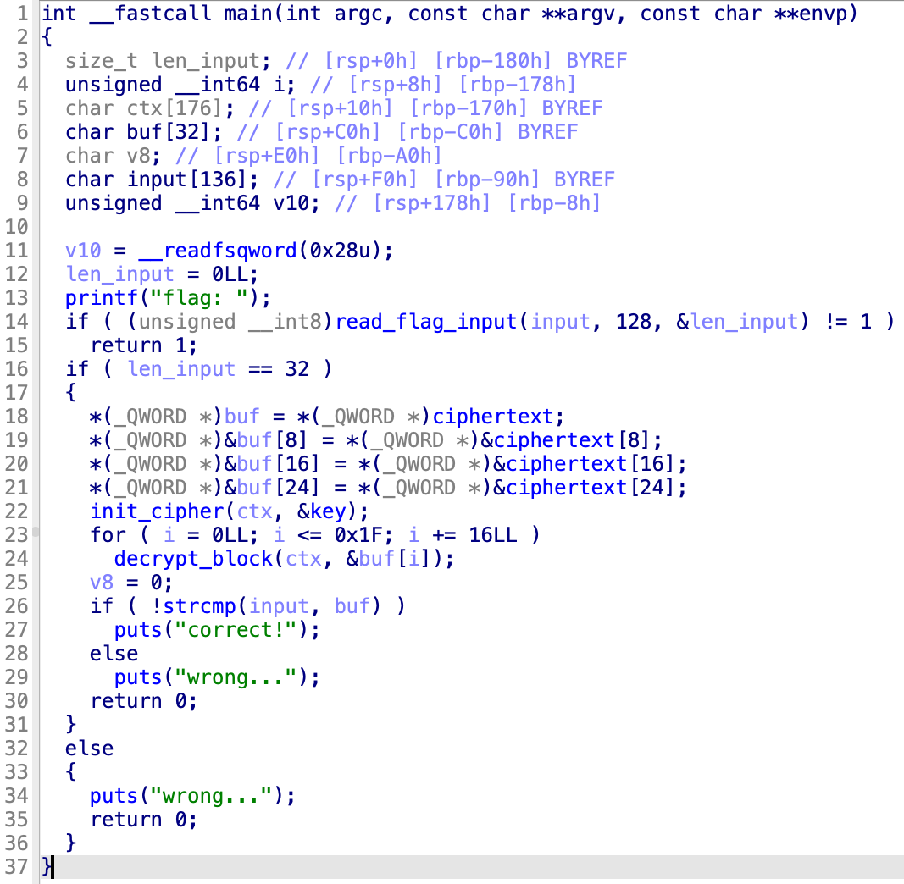
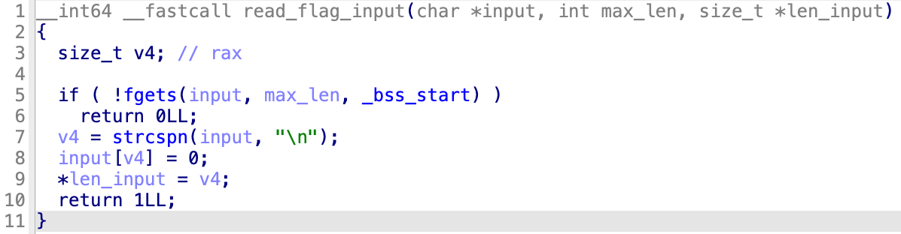
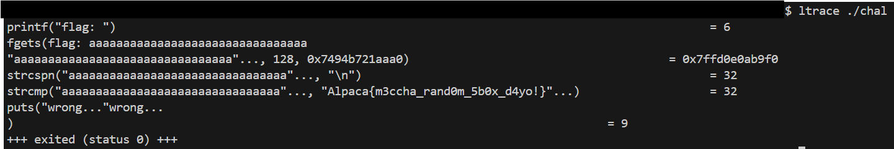

# Sugoi Flag Checker

## 解法

デコンパイルしてmain関数を見てみると、以下のように大まかな動作がわかります (画像はIDA Freeのデコンパイル画面で、変数名や型名をわかりやすくしたもの)。
1. フラグの入力を受け付ける
2. `strcspn` 関数でフラグの長さを計算し、長さが32でない場合終了
3. 謎の暗号で暗号化されたフラグがハードコードされており、それを復号する
4. 入力と復号されたフラグを `strcmp` 関数で比較し、一致すれば `correct!` と表示

よって、問題のバイナリを実行して適当に32文字入力すると、`strcmp` 関数の引数にフラグが現れるはずです。
[ltrace](https://man7.org/linux/man-pages/man1/ltrace.1.html) コマンドを使うと、動的ライブラリの関数呼び出しを追跡することができて、一発でフラグが見れます。

デバッガ (gdbなど) で `strcmp` 関数が呼び出される直前にブレークポイントを張って引数を読む方法でも解けます。

ちなみに、使われている暗号はAESのsboxをランダムな順列に差し替えたものです。Pythonで書き直したものを置いておきます ([solve2.py](./solve2.py))。
